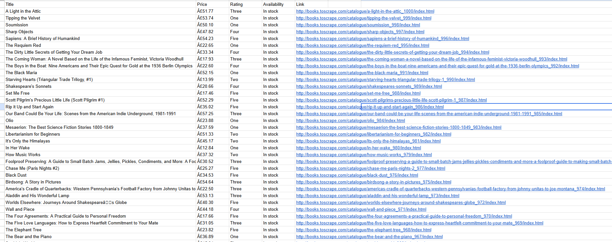

# 🚀 Automated Web Scraper for E-Commerce Data

An enterprise-grade Python script designed to automate data extraction from modern e-commerce structures. This tool targets multi-page architectures, handles data sanitization, and outputs clean structured data for business analysis.

---

## 🛠️ Key Features
* *Multi-Page Pagination:* Automatically navigates through 20 consecutive pages without hardcoding.
* *Data Cleansing:* Extracts and sanitizes clean titles and raw pricing structures into separate attributes.
* *Robust Exporter:* Generates full-scale, UTF-8 compliant CSV/Excel reports instantly ready for analysis.

---

## 📊 Core Mechanism & Technical Stack
I prefer to prioritize core execution logic and foundational mechanics over simple copy-paste script building.

* *Core Engine:* Python 3
* *Parsing Logic:* BeautifulSoup4 (for DOM tree traversal)
* *HTTP Client:* requests (for connection handling)
* *Storage Protocol:* CSV / pandas data pipelines

---

## 📁 Scraped Dataset Preview
Below is the live result generated directly by the scraper, perfectly mapped into structural columns:

---

## ⚙️ Execution Flow
1. Clone the repository to your environment.
2. Initialize requirements: pip install beautifulsoup4 requests.
3. Execute core logic: python scrape_books.py.
